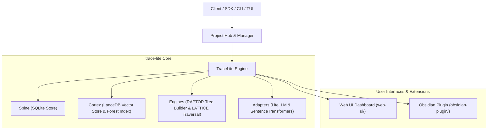

# trace-lite

[](LICENSE)
[](pyproject.toml)

A **self-organizing, multi-project headless database** with hierarchical tree topology and logarithmic search scaling.

`trace-lite` acts as a high-performance filing cabinet and knowledge base:
- **RAPTOR Forest Topology**: Automatic hierarchical clustering & summarization for $O(\log N)$ retrieval scaling.
- **LATTICE Guided Traversal**: LLM-guided top-down traversal over summary trees to retrieve precise evidence without bloating prompt context windows.
- **Minimal Energy Dynamics**: Power-law decay & activation spikes to keep frequently accessed knowledge hot while preserving historical data.
- **Immutable SQLite Spine**: Lossless event log, source artifact store, and atom provenance.
- **Central Project & Database Hub**: Manage isolated database stores, switch project context seamlessly, or run interactive chat REPLs.

---

## 🏗️ Architecture



---

## ⚡ Installation & Setup

You can install `trace-lite` as a standalone CLI tool/Python library for personal use, or set up the repository for local development.

### 🌐 Option A: Global CLI Tool Installation (Recommended for Personal Use)

Use `uv tool install` (or `pipx`) to install `trace-lite` into an isolated global environment so the `trace-lite` executable is directly available anywhere in your terminal:

```bash
# Recommended: Install globally from local repository (with Web UI support)
uv tool install ".[ui]"

# Or install globally from PyPI / git repository:
uv tool install "trace-lite[ui]"
# or from git:
uv tool install "git+https://github.com/anshumani/trace-lite.git#egg=trace-lite[ui]"
```

Once installed, run commands anywhere using `trace-lite` or short aliases `tracel` / `tl`:
```bash
tl configure       # (or trace-lite configure / tracel configure)
tl chat            # Launch interactive Chat REPL
tl projects        # Launch Project Hub TUI
```

#### Installing as a Python Library / SDK Module

If you are importing `trace-lite` into your own Python project:
```bash
pip install trace-lite
# or with uv:
uv add trace-lite
```
*(Alternatively, execute CLI via module runner: `python -m trace_lite.cli configure`)*

---

### 💻 Option B: First-Time Developer Onboarding (Git Repository Setup)

If you are cloning this repository from GitHub for the first time:

#### 1. Clone the Repository
```bash
git clone https://github.com/anshumani/trace-lite.git
cd trace-lite
```

#### 2. Create Virtual Environment & Install Dependencies

**Using `uv` (Recommended — fast resolution):**
```bash
# Sync virtual environment with all extras (ui + dev dependencies) in editable mode
uv sync --all-extras
```

**Using standard `pip`:**
```bash
# Create and activate virtual environment
python -m venv .venv

# On Windows (PowerShell):
.venv\Scripts\Activate.ps1
# On Linux / macOS:
source .venv/bin/activate

# Install in editable mode with UI and Dev extras
pip install -e ".[ui,dev]"
```

#### 3. Configure LLM Providers & API Keys
Run the interactive configuration wizard to set up your LLM credentials (Gemini, OpenAI, Anthropic, Ollama, etc.):

```bash
# In an activated virtualenv:
trace-lite configure

# Or using uv runner without manually activating venv:
uv run trace-lite configure

# Or using Python module runner:
python -m trace_lite.cli configure
```

#### 4. Verify Local Installation & Run Tests
Ensure all unit tests pass cleanly:
```bash
# With activated venv:
pytest

# Or using uv:
uv run pytest
```

---

## 🚀 Quick Start (CLI & TUIs)

### 1. Interactive Project Hub TUI
Manage isolated databases, create new project stores, switch contexts, or safely delete projects:

```bash
trace-lite projects
```

```text
====================================================================
               trace-lite — Project & Database Hub
====================================================================

Available Projects:
--------------------------------------------------------------------
 #   Status   Project Name       Atoms   Trees   Path
--------------------------------------------------------------------
 1   ★ Active  main_kb            1,240     12    ~/.trace_lite/dbs/main_kb
 2             work_docs            850      8    ~/.trace_lite/dbs/work_docs
 3             research_papers    3,100     24    /data/research
--------------------------------------------------------------------

Actions:
 [O] Open / Switch Active Project
 [C] Create New Project
 [D] Delete Project (with Safety Guardrails)
 [R] Register Existing Folder
 [Q] Quit
```

### 2. Interactive Database Chat REPL
Talk directly with the active project database and execute slash commands:

```bash
trace-lite chat
```

#### In-Chat Slash Commands

| Command | Parameters | Description |
| :--- | :--- | :--- |
| `/projects` or `/list` | None | List all registered database projects and stats |
| `/use` or `/switch` | `<db_name>` | Switch active database instantly |
| `/create` or `/new` | `<db_name>` | Create a new isolated database and switch context |
| `/delete` | `<db_name>` | Delete a database (with safety confirmation) |
| `/ingest` | `<file_path \| text>` | Ingest a file or raw string into active DB |
| `/consolidate` | `[tree_id]` | Build / rebuild RAPTOR summary trees |
| `/status` | None | View atom count, token estimate, and tree stats |
| `/mode` | `hybrid \| tree \| flat` | Change retrieval strategy mode |
| `/help` | None | Display slash command help menu |
| `/exit` or `/quit` | None | Exit chat REPL session |

---

## 🛠️ CLI Command Reference

| Command | Arguments / Flags | Description |
| :--- | :--- | :--- |
| `trace-lite projects` | None | Launch interactive Project Hub TUI |
| `trace-lite chat` | None | Launch interactive Chat REPL TUI |
| `trace-lite use` | `<project_name>` | Switch active global database project |
| `trace-lite delete` | `<project_name> [--force]` | Delete a database project and purge its directory |
| `trace-lite ingest` | `[TEXT] [-f FILE] [-n NAME]` | Ingest text or document file into active DB |
| `trace-lite consolidate` | `[--tree-id ID]` | Consolidate pending atoms into RAPTOR summary trees |
| `trace-lite query` | `<query_text> [-k 5] [--mode hybrid\|tree\|flat]` | Query active database with LATTICE traversal |
| `trace-lite status` | None | Display active database capacity metrics & statistics |
| `trace-lite trees` | None | List all summary trees in the active forest |
| `trace-lite export` | `<output.zip>` | Export spine and cortex databases to zip archive |
| `trace-lite providers` | `[--list]` | Interactive TUI wizard to configure LLM providers & API keys |
| `trace-lite configure` | None | Alias for provider configuration wizard |
| `trace-lite visualize` | `[--web] [--host HOST] [--port PORT]` | Render terminal visualizer or launch web dashboard |
| `trace-lite ui` | `[--host HOST] [--port PORT]` | Launch interactive Web UI visualizer dashboard |

> **Note**: Pass `--data-dir <path>` to any command to temporarily override the active project path.

---

## 🐍 Python SDK Usage

```python
from trace_lite import TraceLite
from trace_lite.projects import ProjectManager

# 1. Project Management via SDK
pm = ProjectManager()
pm.create_project("ai_research", description="AI Research Papers")
active_path = pm.get_active_project_path()

# 2. Database SDK Operations
db = TraceLite(active_path)

# Ingest text or files
db.ingest(
    "LATTICE uses LLM-guided top-down traversal over summary trees.",
    document_name="Architecture Notes"
)
db.ingest_file("./paper.md", document_name="LATTICE Paper")

# Consolidate into RAPTOR summary forest
db.consolidate()

# Hierarchical Querying with LATTICE
res = db.query("How does LATTICE achieve logarithmic search?", top_k=5, mode="hybrid")

for item in res.items:
    doc_name = item.source_artifact.document_name if item.source_artifact else "Unknown"
    print(f"[{item.score:.3f}] {doc_name}: {item.atom.content[:100]}")
    if item.traversal_path:
        print(f"  Path: {' -> '.join(item.traversal_path)}")
```

---

## 📦 Extensions & Interfaces

- **[Obsidian Plugin](obsidian-plugin/README.md)**: Integrate `trace-lite` hierarchical RAG directly into your Obsidian vault notes.
- **[Web UI Dashboard](web-ui/README.md)**: Interactive 3D visualization and dashboard powered by React and Three.js.

---

## 🤝 Contributing

Contributions are welcome! Please read [`CONTRIBUTING.md`](CONTRIBUTING.md) for details on our code of conduct, development environment setup, and submission process.

---

## 📄 License

Licensed under the **Apache License, Version 2.0**. See [`LICENSE`](LICENSE) and [`NOTICE`](NOTICE) for details.

