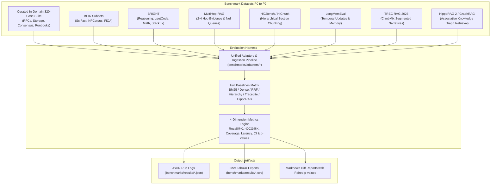

# Trace-Lite SOTA Benchmark Suite

Production-grade, publication-ready benchmarking harness for the Trace Memory Substrate, evaluating retrieval quality, structural self-organization, and operational throughput against 6 baseline families across tiers **P0 through P2 (including HippoRAG)**.



---

## 1. Quick Start

### Setup & Pre-fetch Curated Datasets
Download and normalize public datasets into local verified offline cache:
```bash
# Setup specific datasets
python -m benchmarks.runner setup --dataset scifact
python -m benchmarks.runner setup --dataset hipporag-sample
python -m benchmarks.runner setup --dataset trec-rag
python -m benchmarks.runner setup --dataset hichunk
python -m benchmarks.runner setup --dataset longmemeval
python -m benchmarks.runner setup --dataset ann

# Or setup all public suites at once
python -m benchmarks.runner setup --dataset all
```

### Run the Curated 320-Query In-Domain Suite
```bash
python -m benchmarks.runner run \
  --dataset benchmarks/datasets/trace_engineering_curated.json \
  --baselines bm25,dense,hybrid_rrf,flat_hierarchy,hipporag_ppr \
  --concurrency 4 \
  --format all
```

### Compare Two Benchmark Runs (Paired Significance & 95% CI)
```bash
python -m benchmarks.runner compare \
  --current benchmarks/results/run_20260814_142927.json \
  --baseline benchmarks/results/run_20260814_142000.json \
  --output benchmarks/results/comparison_report.md
```

### Run Synthetic Scale Ladder Stress Testing (1K $\to$ 1M Atoms)
```bash
python -m benchmarks.runner scale --tier 10k --baselines bm25,dense,hybrid_rrf --concurrency 4
```

---

## 2. Benchmark Portfolio Matrix (P0 $\to$ P2)

| Tier | Dataset | Evaluation Axis | Source Adapter |
|---|---|---|---|
| **P0** | **Curated In-Domain Suite** | 320 reviewed queries across 8 categories (40 each: direct lookup, chronology, contradiction, cross-domain, global context, multi-hop, historical, out-of-scope). | `benchmarks/datasets/trace_engineering_curated.json` |
| **P0** | **BEIR** | Zero-shot domain generalization (SciFact, NFCorpus, FiQA). | `BeirAdapter` |
| **P0** | **BRIGHT** | Reasoning-intensive queries (Coding, Math, StackExchange) where nearest-neighbor cosine similarity fails. | `BrightAdapter` |
| **P0** | **MultiHop-RAG** | 2,556 real-world multi-hop queries across 2–4 documents (Inference, Comparison, Temporal, Null). | `MultiHopAdapter` |
| **P0** | **TREC RAG 2026** | Large-scale deep retrieval over ClimbMix segmented collections. | `TrecRagAdapter` |
| **P0/P1** | **HiCBench / HiChunk** | Documents with annotated multi-level sections/subsections and granular atom boundaries. | `HiChunkAdapter` |
| **P1** | **LongMemEval** | 500 questions on temporal updates, multi-session memory, and selective forgetting. | `LongMemEvalAdapter` |
| **P1** | **MTEB / LMEB** | Evaluates embedding bi-encoders against standardized retrieval benchmarks. | `MtebAdapter` |
| **P1** | **ANN Scale** | Vector index recall vs. QPS throughput, latency percentiles, and memory footprint. | `AnnScaleAdapter` |
| **P2** | **HippoRAG 2 / GraphRAG** | Knowledge Graph associative retrieval with Personalized PageRank (PPR). | `HippoRagAdapter` / `HippoRagPPRRetriever` |

---

## 3. Evaluated Baselines

- `bm25`: Okapi BM25 Lexical Keyword Retriever.
- `dense`: `sentence-transformers/all-MiniLM-L6-v2` Flat Dense Bi-Encoder.
- `dense_bge`: `BAAI/bge-large-en-v1.5` Dense Bi-Encoder.
- `hybrid_rrf`: Lexical BM25 + Dense Reciprocal Rank Fusion ($k=60$).
- `flat_hierarchy`: Structure-only parent/child centroid clustering without LLM summaries.
- `trace_flat`: LanceDB flat dense vector retrieval.
- `trace_tree`: LATTICE top-down hierarchical tree traversal.
- `trace_hybrid`: LATTICE combined tree navigation + flat dense retrieval.
- `hipporag_ppr`: Knowledge Graph associative retrieval with Personalized PageRank (PPR).

---

## 4. Release Gates & Quality Thresholds

When running CI release validation, use `--assert-gate`:
- **Complete Gold Coverage@10** $\ge 80.0\%$
- **Citation Precision@5** $\ge 90.0\%$
- **Source Atom Coverage** $= 100.0\%$ (zero dropped atoms)
- **Abstention Accuracy** $\ge 95.0\%$
- **Release Authority Check**: Requires `release_authority: true` on the benchmark manifest.
