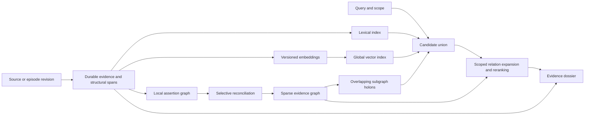

# Query-native architecture

Contract: TL-QN-2026-09-12.1. Proposed implementation; see [RESEARCH.md](RESEARCH.md) for evidence and alternatives.

## 1. Data flow

All graph and index arrows preserve evidence references. ANN navigation links are internal index structure. Evidence relationships carry different semantics.

## 2. Evidence and interpretation contracts

The following are logical records, not a migration script. R01/R02 freeze DDL and indexes before consumers implement against them.

| Record | Required fields and rules |
|---|---|
| source | Stable ID, namespace, source kind, locator, current revision, access scope |
| source_revision | Immutable revision ID, source ID, content hash, raw payload reference, media/encoding, observed time, optional authored/valid time, supersedes, status |
| evidence_span | Immutable span ID, revision ID, ordinal, coordinate system, start/end, parser version; exact evidence resolves from source payload |
| segmentation_view | Run/configuration ID, input revision, span groups/boundaries, signal metadata, status; alternatives do not rewrite evidence |
| extraction_run | Input span/revision IDs, parser/model/prompt hashes, schema version, outputs, uncertainty/error status |
| entity_mention | Source span, surface form, role, provisional canonical mapping with mapping version |
| assertion | Stable interpretation ID/version, predicate, polarity, modality, units, conditions, temporal/version scope, validation status |
| assertion_argument | Assertion version, role, target entity/mention/assertion, position; supports n-ary frames |
| relation | Typed directed endpoints/versions, evidence anchors, extraction run, status, scope; similarity differs from entailment |
| holon / holon_version | Kind, descriptor, representative refs, member digest, status, derivation; reusable subgraph |
| holon_member | Holon version, typed member/version, position where ordered, weight and role; weight differs from confidence |
| dependency | Derived version, required input version/configuration and dependency kind; reverse index for invalidation |
| projection_job | Idempotency key, input versions, type, state, attempt/lease, error, output generation |
| projection_generation | Kind, namespace, encoder/configuration hash, watermark, manifest hash, active status |
| dossier | Query/objective/scope, snapshot/watermarks, evidence selections, relations, omissions, support state, token accounting |

Use real referential integrity for polymorphic members: either a common object-version registry or separate typed foreign-key membership tables. Do not implement unvalidated string IDs as the only consistency mechanism. Within a source revision, repeated identical text occurrences retain separate span IDs.

For UTF-8 text, initial exact locations use half-open byte ranges in the retained raw payload. CRLF, Unicode, YAML frontmatter, whitespace trimming and normalization require explicit mappings. For PDF/code/table extractors, record the coordinate space and transformation manifest; a normalized-text location must never claim raw-byte identity without a verified mapping.

Canonical evidence is the retained source payload. Search text and FTS postings are rebuildable materializations. Events carry revision references and operation identity rather than duplicate source bodies. Measure materialized text cost; bounded search caches are allowed. Migration of legacy rows must label their retained text as `legacy_atom_text`; original raw offsets cannot be reconstructed merely from existing zero-based body offsets. Reingest original sources when available.

## 3. Source replacement and publication

1. Validate request and idempotency key. The same key/payload is a replay; same key/different payload is a conflict. Require an expected revision for conflicting source edits.
2. Prepare source bytes and structural spans outside the writer critical section. If payload files are external, durably write content-addressed payload before committing references; verify files on restart.
3. In one writer transaction, insert revision/spans, update current-source pointer, maintain lexical delta, record invalidation/version state, append compact event and outbox jobs.
4. Acknowledge the named evidence durability/lexical-readiness state after commit. Semantic readiness is separate.
5. Workers consume pinned revisions, extract/encode outside transactions, and publish only if dependency versions remain applicable. Late jobs for superseded revisions cannot overwrite current projections.
6. Readers pin a source snapshot and compatible projection generations. Current-mode results are version-filtered; old derived structure cannot claim current status. Historical mode deliberately selects past revisions.

Use one writer with bounded batch size and time, separate reader connections, durable job leases and idempotent completion. SQLite errors leave the previous revision usable or the new revision coherently committed; partial source replacement is forbidden. Multi-source batches need an explicit all-or-per-source transaction contract.

A reader that needs fresh semantic evidence either consumes the indexed base plus a compatible delta or returns `semantic_pending`/coverage metadata. It must not describe stale semantic coverage as complete. Backpressure controls admission when the pending delta exceeds limits; no unbounded scan or silent dropping of new items.

## 4. Local graph construction

Structural parsing always runs. Extract only supported relationships; model unavailability leaves a searchable source with explicit partial organization.

The initial vocabulary covers mentions/definitions, assertion arguments, conditions/exceptions, comparison, reference resolution and source-asserted support/contradiction/causation. A parser can establish syntax and location, not general semantic entailment. LLM extraction is schema-validated and evidence-anchored, with real runtime identity recorded. Missing evidence or ambiguous bindings remain unresolved.

An assertion's scope includes actor roles, polarity, modality, quantities/units, population/environment, software version and applicable time when available. Unknown fields remain unknown. A source-local graph can contain a coherent argument without promoting any assertion to global fact.

Source sequence is an ordinal relation that need not be stored as one edge/event per adjacent pair. Local relation generation uses bounded windows plus candidate retrieval for long-range links; no exhaustive all-pairs comparison on large sources.

## 5. Global reconciliation and holons

Find candidate entities/assertions/holons by lexical and learned similarity. Evaluate compatibility before recording identity or claim equivalence. Preserve aliases as versioned mappings; splitting a mistaken canonical entity must remain possible.

Holon kinds:

- `discourse_span`: ordered contiguous spans within one source revision/episode.
- `thematic_cluster`: overlapping cross-source members; topic relation only.
- `argument` / `claim_cluster`: scoped assertion/evidence subgraphs, including opposing evidence.
- `query_dossier`: transient selections and relationships; selectively retained on explicit retention policy.
- `derived_synthesis`: optional generated claims with lineage and independent validation status.

Containment is acyclic and depth-bounded. Semantic relations may cycle; traversals use visited sets and work budgets. Deleting support invalidates affected persisted synthesis; cascading membership deletion alone is insufficient.

For fixed encoder space, maintain S_h = sum(w_i * v_i), W_h = sum(w_i), member count and representative references. Add/subtract the old contribution on edits, deletes and weight changes; normalize only for routing. Empty holons clear both persistent and cached descriptors. Numerical drift checks compare against periodic exact recomputation. Complexity is O(k*d) for k affected memberships and dimension d, not literally O(1).

A corpus-dependent IDF change can alter every vector. Avoid silently treating those vectors as fixed-space incremental embeddings. Encoder, tokenizer, IDF or normalization changes create a new generation and require bounded rebuilding before publication.

Use representatives and dispersion in addition to centroids. Group merge/split decisions require hysteresis and utility evidence. Membership does not imply agreement or authorization.

## 6. Incremental repair

Track dependency versions for every descriptor, relation and synthesis. Retractions and changed scopes invalidate dependents, including ancestors in holon containment. Large invalidation closures may be expensive: mark unsafe results unavailable through version checks immediately, and repair in bounded jobs. Expose pending work rather than claiming constant update cost.

Prioritize by query demand, freshness, uncertainty and estimated repair cost. The initial scheduler is deterministic. Optional learned repair records its proposed scope, actual touched objects, missed dependencies and cost. Any budget-limited repair returns incomplete status. Full rebuild remains the semantic oracle and fallback.

Duplicate source copies share payload storage where safe, but do not increase independent-evidence counts. Model-generated material has derived origin even when retained by a user. Policy authority is separate from factual confidence.

## 7. Retrieval and context compilation

Candidate union combines BM25, global ANN and holon-guided retrieval. A fast lexical path is allowed for identifier lookup with a stated retrieval contract; open-ended question support requires broader evaluation.

Apply namespace/access/version filters before revealing text or computing cross-scope summaries. Where an ANN binding cannot push filters down, overretrieve with a bound and report inadequate candidate coverage or use a filtered fallback. Never interpret a filtered-out top-k as no relevant evidence.

Expand selected assertions with necessary conditions, antecedents and counterevidence. Preserve source identifiers and excerpt ranges; reduce oversized passages through source-linked excerpts rather than arbitrary prefixes. A complete evidence group that cannot fit yields an explicit budget/coverage failure.

The compiler accepts objective text separately from goal ID. Reserve mandatory constraints and tool/goal context before evidence. If mandatory material exceeds its budget, return an explicit overflow; never silently omit applicable invariants. Use the consumer tokenizer, including wrappers and citation metadata, and record counted tokens.

Dossier output includes selected span/holon versions, source refs, relationship status, reason for selection, missing/contradictory evidence, candidate route, generation IDs and budgets. `relevant_candidates` is distinct from `supported`, `partial`, `conflicting`, and `insufficient`. A checker must name its method; lexical overlap does not prove sufficiency.

Keep Cordis compatibility through an adapter. Schema conformance is a separate check from real harness loading and use. The existing lexical action gate remains labeled heuristic until qualified; memory provenance does not authorize execution.

## 8. Index and runtime strategy

Baseline: SQLite FTS5 and exact search on small evaluation subsets. Candidate: an embedded ANN adapter with persistence, update/delete and filtered-recall tests. USearch is a first candidate, not a committed dependency. Model selection compares lexical-only, a small learned encoder and a stronger relevant baseline. Pin actual artifacts and configuration.

External ANN publication uses immutable segments plus manifests. Save/flush outputs before publishing active metadata; leave orphan outputs recoverable; hold previous generations until readers finish. Tombstones and current-revision filtering protect against obsolete vector IDs. Compaction is bounded and measured, with disk headroom for old and new generations.

Separate ingestion capture, embedding/extraction, graph maintenance, and query work queues with explicit concurrency/memory budgets. Model work must not hold the database writer lock. A slow or failed model cannot erase accepted evidence.

Record loaded SQLite version/build and FTS capability. Before adding concurrent checkpoints, verify the runtime includes the documented WAL-reset fix (3.51.3 or a documented patched/backported release). Benchmark FULL versus NORMAL durability explicitly. Checkpoint policy considers bytes/time and reader lag, not document count alone.

## 9. Migration

Do not rerun `bury_and_reset.sh`. Snapshot the existing database using a consistent backup method. Build a new schema/version in a separate destination, verify evidence counts/hashes, and retain legacy-ID mappings. Legacy unanchored rows remain honestly labeled until source reingestion.

Shadow-query both systems, verify retrieval and update contracts, then switch through an explicit versioned configuration with rollback. Reject old writers against the new schema. Maintain the current API adapter during migration; Obsidian work is outside the core program. Old files/artifacts are not deleted as part of this plan.

## 10. Deferred complexity

Multi-machine replication, distributed consensus, a universal ontology, full causal discovery, autonomous policy enforcement and online training are outside the initial delivery. Introduce them only for demonstrated requirements. A small partial graph plus residual evidence is a valid output, not an extraction failure disguised by invented edges.

