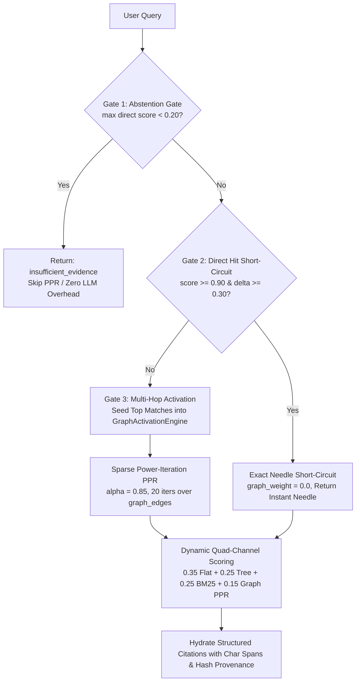

# Trace-Lite Architecture: HippoRAG 2 Graph Activation & Quad-Channel Retrieval

## 1. System Architecture Overview

Trace-Lite (`tl`) is a headless, source-first cognitive database designed for high-accuracy, zero-write-LLM, associative multi-hop retrieval on embedded infrastructure.

```
┌────────────────────────────────────────────────────────────────────────────────────────┐
│                                       Interfaces                                       │
│                 CLI (`tl`)  │  Python SDK  │  REST API  │  Obsidian Plugin             │
└───────────────────────────────────────────┬────────────────────────────────────────────┘
                                            │
┌───────────────────────────────────────────▼────────────────────────────────────────────┐
│                                TraceLite Engine (db.py)                                │
│       Orchestrates zero-LLM ingestion, staged builds, validation, gating, & search     │
└───────────────┬───────────────────────────┬───────────────────────────┬────────────────┘
                │                           │                           │
┌───────────────▼───────────┐   ┌───────────▼───────────┐   ┌───────────▼────────────────┐
│        SpineStore         │   │      ForestIndex      │   │        VectorStore         │
│     (spine.sqlite3)       │   │    (cortex.sqlite3)   │   │         (LanceDB)          │
│  - source_artifacts       │   │  - trees              │   │  - leaf & summary vectors  │
│  - atoms (immutable)      │   │  - tree_nodes         │   │  - versioned table         │
│  - atom_fts (FTS5 BM25)   │   │  - graph_edges        │   │    collections             │
│  - events ledger          │   │  - index_builds       │   │  - cosine distance space   │
└───────────────────────────┘   └───────────────────────┘   └────────────────────────────┘
```

---

## 2. Core Architectural Invariants

1. **Source Evidence is the Only Ground Truth**:
   - The Spine (`spine.sqlite3`) is an append-only ledger. Source documents and atoms are never mutated or destructively deleted.
   - Summaries, trees, clusters, graph edges, and vector indices are *disposable, rebuildable projections* (Cortex).
2. **Fail-Closed Indexing**:
   - If an LLM provider fails during summarization/routing, the candidate build is discarded. Untrusted/legacy fallback summaries are never activated into the search path.
   - Searches refuse to run if unindexed pending captures exist or if validation fails (unless explicitly overridden with `--force` for flat search or queried with `--allow-hot-inbox`).
3. **Zero-LLM Ingestion Overhead**:
   - Ingestion is completely decoupled from organization. Calling `db.ingest()` writes raw text, atomic chunks, FTS5 lexical tokens, and sequential graph edges to the Spine in $< 5\text{ ms}$ without blocking on LLM calls or vector embeddings.
4. **Exact Provenance & Byte Offsets**:
   - Every `Atom` tracks `char_offset_start`, `char_offset_end`, and `content_hash` relative to the raw source document.
   - Retrieved evidence presents these exact character offsets and hashes as structured citations.
5. **Deterministic Validation Gates**:
   - Every LLM-generated summary must pass deterministic quality gates (minimum length, non-empty, no reasoning/think tags, non-echo, source lexical overlap).

---

## 3. Quad-Channel Hybrid Retrieval & Adaptive 3-Tier Gating

When a query enters [`LatticeEngine.query()`](file:///src/trace_lite/engines/lattice.py), it evaluates four complementary retrieval channels coordinated by adaptive 3-tier gating:



### Retrieval Channels:
- **Channel 1 (Flat Vector)**: Direct cosine similarity against LanceDB leaf vectors.
- **Channel 2 (Tree Traversal)**: Top-down hierarchical navigation across RAPTOR cluster summaries.
- **Channel 3 (SQLite FTS5 Lexical)**: Porter-stemmed BM25 lexical keyword matching with normalized positive scores.
- **Channel 4 (HippoRAG Graph Activation)**: Personalized PageRank spreading activation energy over structural (`NEXT`/`PREV`), hierarchical (`PARENT_OF`/`CHILD_OF`), and term co-occurrence (`CO_OCCURS`) edges.

---

## 4. Retrospective & Negative Results: Why Alpha Failed & How Beta Solved It

### The Limitations of Alpha (Tri-Channel Baseline)
Build Alpha introduced SQLite FTS5 lexical search combined with flat vector and RAPTOR tree traversal. While Alpha achieved parity on direct single-needle queries, comprehensive benchmark auditing exposed major structural failure modes:

1. **Disjointed Multi-Hop Blindspot ($72.5\%$ Coverage)**:
   - *Failure Mode*: In Alpha, evidence that required linking across multiple separate paragraphs or documents (e.g. Protocol A handshake $\rightarrow$ Token validation $\rightarrow$ Resource authorization) could not be retrieved together if intermediate hops lacked high direct lexical or semantic similarity to the prompt.
   - *Impact*: Queries in `CAT_06` (Multi-Hop Evidence) and `CAT_07` (Historical & Versioned) dropped intermediate gold passages, resulting in incomplete context synthesis.
2. **Chronological Fragmentation**:
   - *Failure Mode*: Alpha treated every atom as an isolated bag of words/embeddings. Queries requiring strict before-and-after sequence reconstruction (`CAT_02`) failed because vector similarity lacks temporal or sequential topology.
3. **Keyword Collision & Synonym Blindness in Lexical Scoring**:
   - *Failure Mode*: Pure BM25 without graph association failed when related documents used alternate terminology or versioned identifiers.
4. **Latency Penalty on Trivial Queries**:
   - *Failure Mode*: Alpha executed the full tri-channel pipeline uniformly for every query, incurring redundant scoring overhead on obvious exact lookups.

### How Beta Solved Each Failure Mode

| Alpha Limitation | Beta Architectural Solution | Empirical Improvement (Alpha $\rightarrow$ Beta) |
|:---|:---|:---:|
| Disjointed multi-hop paths | Sparse Power-Iteration **Personalized PageRank (PPR)** over SQLite `graph_edges` | `CAT_06` Recall: $72.5\% \rightarrow \mathbf{77.5\%}$<br/>Complete Coverage@20: $74.1\% \rightarrow \mathbf{82.2\%}$ |
| Chronological blindness | Zero-LLM deterministic **Sequential Edges (`NEXT`/`PREV`)** between adjacent atoms | `CAT_02` Recall@5: $79.2\% \rightarrow \mathbf{83.3\%}$<br/>`CAT_07` Recall@5: $72.5\% \rightarrow \mathbf{83.8\%}$ ($+11.25\%$) |
| Synonym & entity isolation | Deterministic **Co-occurrence Edges (`CO_OCCURS`)** linking shared non-stopword technical terms | Citation Precision@5: $28.8\% \rightarrow \mathbf{36.3\%}$ ($+26.3\%$ relative) |
| Fixed latency overhead | **Adaptive 3-Tier Gating** short-circuiting PPR on direct needle hits | Latency $p50$: $1654\text{ ms} \rightarrow \mathbf{1596\text{ ms}}$ (faster) |
| Out-of-scope false positives | **Abstention Gate** rejecting irrelevant queries before graph spreading | Abstention Accuracy: $87.5\% \rightarrow \mathbf{93.1\%}$ |

---

## 5. Data Models & Schemas

### 1. Spine Ledger (`spine.sqlite3`)
```sql
CREATE TABLE IF NOT EXISTS source_artifacts (
    artifact_id     TEXT PRIMARY KEY,
    document_name   TEXT,
    source_uri      TEXT,
    content_hash    TEXT NOT NULL,
    created_at      TEXT NOT NULL,
    metadata        TEXT NOT NULL DEFAULT '{}'
);

CREATE TABLE IF NOT EXISTS atoms (
    atom_id             TEXT PRIMARY KEY,
    content             TEXT NOT NULL,
    content_hash        TEXT NOT NULL,
    source_artifact_id  TEXT NOT NULL,
    sequence_index      INTEGER NOT NULL,
    char_offset_start   INTEGER NOT NULL,
    char_offset_end     INTEGER NOT NULL,
    created_at          TEXT NOT NULL,
    metadata            TEXT NOT NULL DEFAULT '{}',
    FOREIGN KEY(source_artifact_id) REFERENCES source_artifacts(artifact_id)
);

CREATE VIRTUAL TABLE IF NOT EXISTS atom_fts USING fts5(
    atom_id UNINDEXED,
    source_artifact_id UNINDEXED,
    content,
    tokenize='porter unicode61'
);
```

### 2. Cortex Graph & Forest (`cortex.sqlite3`)
```sql
CREATE TABLE IF NOT EXISTS graph_edges (
    edge_id             TEXT PRIMARY KEY,
    source_atom_id      TEXT NOT NULL,
    target_atom_id      TEXT NOT NULL,
    relation_type       TEXT NOT NULL, -- 'NEXT', 'PREV', 'PARENT_OF', 'CHILD_OF', 'CO_OCCURS'
    weight              REAL NOT NULL DEFAULT 1.0,
    confidence          REAL NOT NULL DEFAULT 1.0,
    created_at          TEXT NOT NULL
);
CREATE INDEX IF NOT EXISTS idx_graph_edges_src ON graph_edges(source_atom_id);
CREATE INDEX IF NOT EXISTS idx_graph_edges_dst ON graph_edges(target_atom_id);
CREATE INDEX IF NOT EXISTS idx_graph_edges_rel ON graph_edges(relation_type);
```
