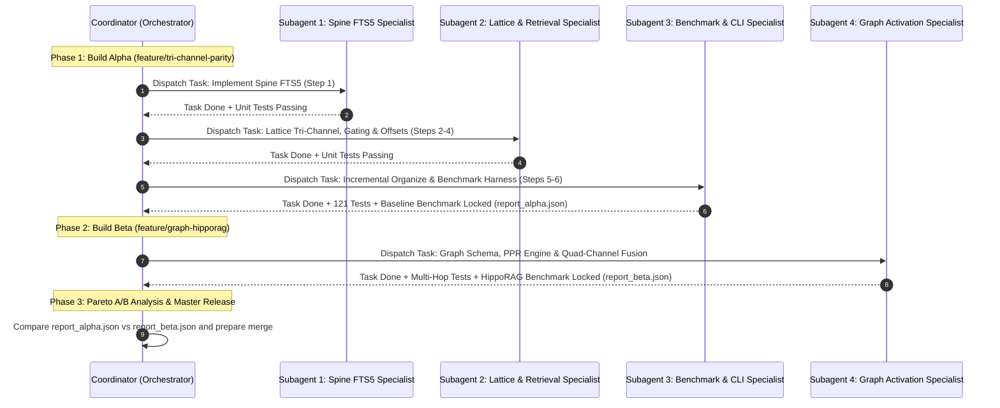

# Subagent Execution Runbook: Sequential Phased Builds

This document governs the sequential execution of subagents across Build Alpha and Build Beta.

---

## 1. Execution Principles

1. **Strictly Sequential Execution**: Subagents work one at a time in a deterministic pipeline. A subagent must complete its task and pass all automated tests before the next subagent is dispatched.
2. **Ground Truth from Disk**: Every subagent is instructed to read `docs/dev/GLOBAL_CONTEXT.md` and the relevant `BUILD_*_SPEC.md` from disk before making changes.
3. **Automated Verification at Every Gate**: No branch or step is marked complete without running `uv run pytest -o pythonpath=.` and verifying 0 test failures.

---

## 2. Sequential Subagent Dispatch Pipeline

---

## 3. Subagent Task Contracts

### Subagent 1: Spine FTS5 Specialist
- **Specification**: `docs/dev/BUILD_ALPHA_SPEC.md` (Step 1)
- **Target Files**: `src/trace_lite/spine/store.py`, `tests/test_spine.py`
- **Output**: FTS5 virtual table created, `search_lexical` returning normalized scores, unit tests passing.

### Subagent 2: Lattice & Retrieval Specialist
- **Specification**: `docs/dev/BUILD_ALPHA_SPEC.md` (Steps 2, 3, 4)
- **Target Files**: `src/trace_lite/engines/lattice.py`, `src/trace_lite/db.py`, `tests/test_engines.py`
- **Output**: Tri-channel hybrid fusion, sufficiency gating, exact citation offsets, hot inbox search.

### Subagent 3: Benchmark & CLI Specialist
- **Specification**: `docs/dev/BUILD_ALPHA_SPEC.md` (Steps 5, 6), `docs/dev/BENCHMARK_MATRIX.md`
- **Target Files**: `src/trace_lite/engines/benchmark.py`, `src/trace_lite/cli.py`, `benchmarks/`
- **Output**: Incremental organize, `tl benchmark` CLI command, baseline benchmark execution.

### Subagent 4: Graph Activation Specialist
- **Specification**: `docs/dev/BUILD_BETA_SPEC.md`
- **Target Files**: `src/trace_lite/cortex/forest.py`, `src/trace_lite/engines/graph.py`, `src/trace_lite/engines/lattice.py`
- **Output**: `graph_edges` table, `GraphActivationEngine` (PPR), adaptive gating, quad-channel retrieval.
